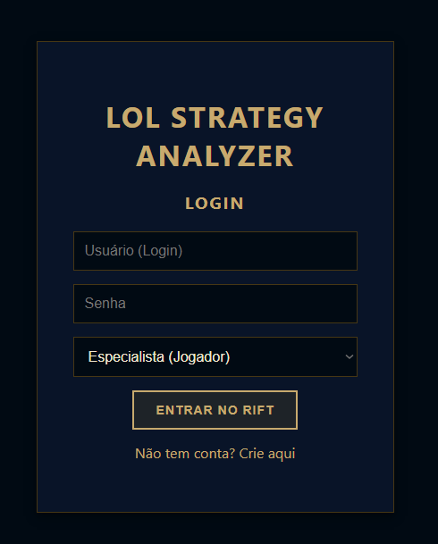
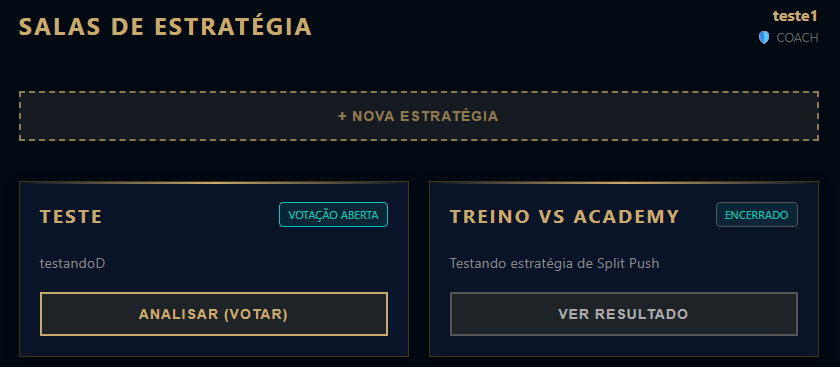
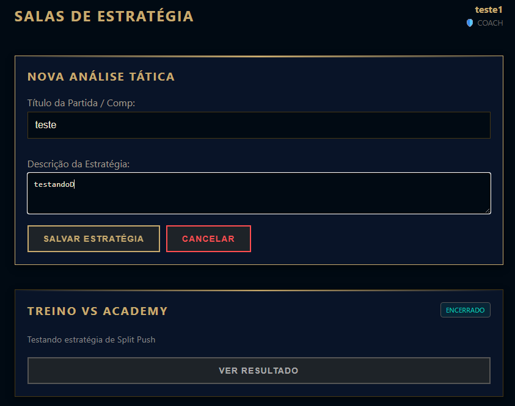
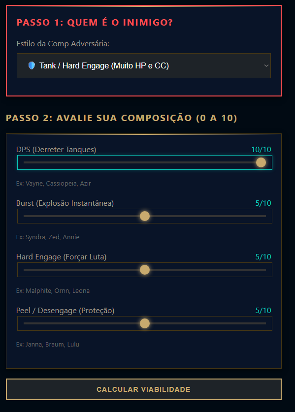
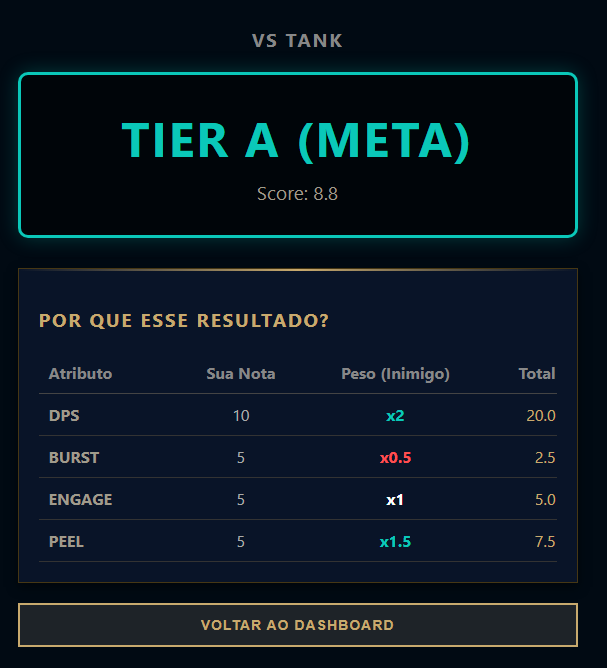

# LoL Strategy Analyzer ⚔️

Ferramenta Full Stack para análise tática e tomada de decisão em partidas de League of Legends. O sistema permite que times (Coaches e Players) votem em estratégias e utiliza um algoritmo de análise de dados para calcular matchups favoráveis com base em estatísticas de dano e arquétipos de inimigos.

---

## 📸 Galeria do Projeto

### 1. Login Hextech
Autenticação segura com design temático imersivo.

### 2. Dashboard de Estratégias
Visão geral das partidas. O Coach pode acompanhar quais votações estão abertas e os players acessam as salas.

### 3. Área do Coach (Criação)
Interface exclusiva para Coaches definirem o título e a descrição tática da nova análise.

### 4. Sala de Votação (Análise)
Onde a mágica acontece: O player define o arquétipo do inimigo (ex: Tank, Poke) e ajusta os sliders de status do time (DPS, Burst, Engage, Peel).

### 5. Resultado da Análise (Algoritmo)
O sistema processa os inputs contra a matriz de pesos do backend e retorna o Tier da composição com feedback visual instantâneo.

---

## 🎯 Funcionalidades

- **Dashboard de Estratégia:** Visualização de partidas e status de votação em tempo real.
- **Sistema de Votação:** Sessões interativas onde players calibram os atributos do time.
- **Análise Algorítmica:** O backend processa inputs de status contra arquétipos de inimigos para sugerir a viabilidade (Tier S, A, B...).
- **Autenticação Segura:** Login e registro com hash de senhas (bcrypt) e controle de acesso (Coach vs Player).

## 🛠️ Tecnologias Utilizadas

- **Frontend:** React, Vite, CSS Modules (Tema Hextech Customizado).
- **Backend:** Node.js, Express.
- **Banco de Dados:** MySQL.
- **Segurança:** Bcrypt, CORS, Dotenv.

## 🚀 Como Rodar

### Pré-requisitos
- Node.js instalado
- MySQL rodando

### Passo 1: Configurar o Backend
1. Entre na pasta do servidor: `cd server`
2. Instale as dependências: `npm install`
3. Crie um arquivo `.env` com as configurações do seu banco (veja `.env.example` ou documentação).
4. Rode o servidor: `npm start`

### Passo 2: Configurar o Frontend
1. Na raiz do projeto, instale as dependências: `npm install`
2. Rode o projeto: `npm run dev`

---
Desenvolvido por **Raoni Mendonça Aguiar Capodeferro** - Focado em Desenvolvimento de Sistemas e Análise de Dados.